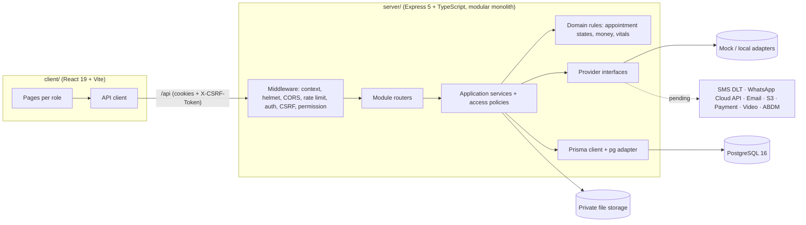

# [APP_NAME] — Clinic & Hospital Management Platform

[APP_NAME] is an India-first outpatient platform for clinics, multi-specialty clinics, hospitals and diagnostic centres. It covers patient registration, appointments and queues, consultations (EMR), vitals, e-prescriptions, investigations, documents, billing, notifications and a patient portal.

> **Status: development / demo build.** All external integrations (SMS, WhatsApp, email, payments, video, health devices, ABDM) are **mocked** by default. Nothing here is certified or claimed compliant with any law or standard — see [docs/COMPLIANCE.md](docs/COMPLIANCE.md).
> The brand name is configurable (`APP_NAME`); docs use `[APP_NAME]`.

## Documentation

| Document | Contents |
|---|---|
| [docs/ARCHITECTURE.md](docs/ARCHITECTURE.md) | Layers, module map, request lifecycle, ERD, RBAC/ABAC, scheduling concurrency, notifications, health data, ADRs |
| [docs/API.md](docs/API.md) | Every REST endpoint, auth/permission, bodies, errors, pagination, idempotency, CSRF |
| [docs/SECURITY.md](docs/SECURITY.md) | Threat model, implemented controls, gaps, hardening checklist |
| [docs/TESTING.md](docs/TESTING.md) | Test strategy, unit/API/E2E/a11y/responsive, running subsets, CI |
| [docs/COMPLIANCE.md](docs/COMPLIANCE.md) | Compliance *readiness* for India (DPDP, TPG 2020, ABDM, CDSCO, TRAI DLT, WhatsApp) |
| [docs/DEPLOYMENT.md](docs/DEPLOYMENT.md) | Build, run, reverse proxy, migrations, secrets, backups/restore, go-live checklist |
| [docs/research/MARKET_RESEARCH.md](docs/research/MARKET_RESEARCH.md) | Phase 0 market & compliance research |

## Features by module

Legend: **Mock** = simulated provider, nothing leaves the system · **Demo-only** = for demonstration, not for clinical use · **Pending** = production integration pending.

| Module | What is implemented (server) |
|---|---|
| Identity & access | Email/password login, httpOnly cookie sessions with rotating refresh tokens, CSRF double-submit, optional bearer mode for API clients, lockout after failed logins, rate limiting, 9 roles × 48 permissions, facility scoping, patient-level ABAC with break-glass. MFA: extension point only (not implemented). |
| Multi-organisation | Organization → Facility → Department → Room; per-org settings (booking horizon, hold minutes, cancellation/reschedule windows, reminder lead, emergency/review wording, prescription footer, lab auto-release). |
| Patients | Registration (self and reception), UHID generation, duplicate detection, medical profile (allergies, history), emergency contact, dependents/proxies (minors ACTIVE, adults PENDING until staff verify), per-channel notification consent with append-only history. |
| Directory | Public facility/department/specialty/doctor search, doctor profile, next available slot, day availability. |
| Appointments | Slot availability from recurring schedules, breaks, holidays, leave/blocks, capacity + overbooking; 2-step HELD→CONFIRMED booking or 1-step; concurrency-safe seat allocation; reschedule/cancel with configurable windows; walk-ins; waitlist; pre-visit intake; reminders; idempotency keys. |
| Queue | Per doctor/facility/day queue, atomic token numbers, call next / recall / skip / requeue / absent / transfer, public display board (token numbers only). |
| Consultation (EMR) | Encounter from appointment, SOAP draft with optimistic concurrency, notes (drafts finalised on completion, addenda after), diagnoses (ICD-10/ICD-11/SNOMED CT/free text codes stored as entered), AI-draft approval gate (no AI provider). |
| Vitals | 8 vital types with unit/plausibility validation, BMI auto-calc, °F→°C, reference-range **review flags** (not diagnoses), correction-by-new-row, trends. |
| Health data | Heart-rate sources with explicit permission states; **Mock** wearable (deterministic scenarios); client-ingest adapters for HealthKit / Health Connect / BLE / wearables (**Pending**); camera PPG = **Demo-only / wellness estimate**; clinician promotion of valid readings to vitals. |
| e-Prescription | Generic-name medication catalogue, draft editing, allergy match warnings, explicit finalize, immutable versions (DB trigger), SHA-256 content hash, session-attestation signing (**not a digital signature certificate**), A4 PDF with doctor registration number, amendments with reason, pharmacist read-only dispensing view. |
| Investigations | Catalogue, order from encounter, lab worklist, status workflow, results with LOW/HIGH/NORMAL flags, corrections kept, report upload, verification, auto-release to patient (configurable), parameter trends, doctor comments. |
| Documents | Upload (PDF/PNG/JPEG, magic-byte checked, size-limited), private storage, short-lived user-bound HMAC download URLs. S3 adapter **Pending**. |
| Billing | Service price list, invoices with line/invoice discounts and tax in integer paise, consultation invoice from doctor fee, payments (cash/card/UPI/online) via **Mock** gateway, refunds, idempotent payments. |
| Notifications | SMS / WhatsApp / email via **Mock** providers (HTTP SMS, WhatsApp Cloud API, HTTP email adapters exist but are **Pending** production onboarding), minimal-content templates, consent checked at enqueue and dispatch, dedupe keys, retry/backoff worker, delivery logs, secure deep links. |
| Teleconsultation | **Mock** video provider, participant-bound join tokens, patient consent on first join, clinician conversion to in-person. |
| Dashboards & reports | Patient, doctor, reception, admin dashboards; appointment/patient/doctor/revenue/clinical reports; CSV export (audited). |
| Audit | Append-only audit log (DB trigger) for logins, access, denials, break-glass, clinical writes, exports, consent changes. |
| Privacy | Patient data export (JSON), privacy requests (export, correction, deactivation, erasure — erasure blocked pending legal review), retention policy placeholders. |
| Interoperability | FHIR R4 `$everything`-style Bundle via a mapping layer; ABDM boundary is **Mock** (`NOT_CONNECTED`). |

## Architecture summary

Modular monolith: one Express API process with module routers, application services, pure domain rules and Prisma data access, plus a React SPA. Details in [docs/ARCHITECTURE.md](docs/ARCHITECTURE.md).



## Prerequisites

| Tool | Version |
|---|---|
| Node.js | ≥ 20.19 (CI uses 22) |
| npm | ≥ 10 |
| PostgreSQL | 16 — local install **or** Docker (`docker compose`) |
| OpenSSL (or any CSPRNG) | to generate `AUTH_SECRET` |

## Installation

```bash
git clone <repo-url> healthcare-app && cd healthcare-app
npm install            # installs all workspaces: server, client, tests
```

## Environment setup

```bash
cp .env.example .env
openssl rand -base64 48      # paste the output into AUTH_SECRET= in .env (min 32 chars)
```

A single `.env` at the repository root is read by the server (`server/src/config/env.ts`), Prisma (`server/prisma.config.ts`) and the seed. `server/.env` may override for local work. The API refuses to start if the configuration is invalid (e.g. missing/short `AUTH_SECRET`, or `ENABLE_TEST_ROUTES=true` with `NODE_ENV=production`).

Key variables (full list with defaults in [docs/DEPLOYMENT.md](docs/DEPLOYMENT.md#environment-variables)):

| Variable | Default | Purpose |
|---|---|---|
| `DATABASE_URL` | — (required) | PostgreSQL connection string |
| `AUTH_SECRET` | — (required, ≥ 32 chars) | JWT + download-URL + join-token HMAC key |
| `APP_NAME` | `[APP_NAME]` | Brand name used in messages, PDFs, logs |
| `APP_BASE_URL` | `http://localhost:5173` | Public web URL used in secure SMS/WhatsApp links (`/s/<token>`) |
| `CORS_ORIGINS` | `http://localhost:5173` | Comma-separated allowed origins (credentials enabled) |
| `DEMO_MODE` | `true` unless `NODE_ENV=production` | Demo banners; "DEMO DATA — NOT A VALID PRESCRIPTION" watermark on PDFs |
| `ENABLE_TEST_ROUTES` | `false` | Mounts `/api/test/*` (mock outbox etc.). Refused in production |
| `SEED_DEMO_PASSWORD` | `Demo@12345` (seed fallback) | Password for all seeded demo accounts — **local development only** |

## Database setup

```bash
docker compose up -d          # PostgreSQL 16 on localhost:5432 (user careflow / careflow_dev / db careflow)
# optional full stack on http://localhost:8080: docker compose --profile app up -d --build  (see docs/DEPLOYMENT.md)
npm run db:generate           # generate the Prisma client into server/src/generated/prisma
npm run db:deploy             # apply committed migrations (prisma migrate deploy)
#   or, when changing schema.prisma during development:
npm run db:migrate            # prisma migrate dev (creates a new migration)
```

**Restricted networks.** The Prisma CLI downloads a native schema-engine binary on first use. If that download is blocked (error like `Failed to fetch sha256 checksum at https://binaries.prisma.sh/... - 403 Forbidden`), apply migrations with the WebAssembly engine instead:

```bash
npm run db:migrate:offline -w server     # = node scripts/offline-migrate.mjs deploy
```

It applies each `server/prisma/migrations/*/migration.sql` in order and records it in `_prisma_migrations` (same format as Prisma), so later `prisma migrate deploy` runs treat them as applied. `node server/scripts/offline-migrate.mjs diff-init <name>` writes an initial migration from `schema.prisma`. `npm run db:generate` works offline once dependencies are installed.

Migrations:

| Migration | Contents |
|---|---|
| `20260926000000_init` | All tables, enums, indexes |
| `20260926000100_db_safeguards` | Partial unique index `Appointment_active_slot_key`, append-only triggers (`AuditLog`, `NotificationConsent`), `PrescriptionVersion` immutability trigger, CHECK constraints |

## Seed demo data

```bash
npm run db:seed
```

> **Destructive:** the seed `TRUNCATE`s every table in the `public` schema (except `_prisma_migrations`) before inserting. Never run it against a database with real data. All data is fictional (names such as "Demo-Sharma", registration numbers `DEMO-REG-…`, emails `@example.test`).

It creates 1 organisation ("Demo Health Network", code `DEMO`), 3 facilities (Riverside Demo Clinic `RSC`, Lakeview Demo Hospital `LVH`, Hillcrest Demo Diagnostics `HCD`), 8 departments, 15 doctors with schedules, 51 patients (incl. one dependent child), ~120 appointments, ~72 completed visits with vitals, ~48 finalized prescriptions (PDFs generated), lab orders, invoices, a Mock Wearable heart-rate source, demo reference ranges and retention placeholders.

### Demo accounts

Password for all accounts: value of `SEED_DEMO_PASSWORD` (development default `Demo@12345`). **Development only — never use in shared or production environments.**

| Email | Role | Scope / notes |
|---|---|---|
| `patient.demo@example.test` | Patient | Priya Demo-Patient; guardian of child "Anika Demo-Patient"; Mock Wearable connected; has past visits, prescriptions, lab results |
| `patient2.demo@example.test` | Patient | Arjun Second-Demo (use for cross-patient access tests) |
| `doctor.demo@example.test` | Doctor | Dr. Asha Varkey, General Medicine, Riverside (`RSC`); daily 08:00–22:00 (break 13:00–14:00); today's appointments seeded |
| `doctor.test@example.test` | Doctor | Dr. Neel Sahasrabuddhe, General Medicine, `RSC`; bookable 00:00–23:59 every day, no seeded appointments (for automated tests) |
| `reception.demo@example.test` | Receptionist | Organisation-wide |
| `reception.lakeview@example.test` | Receptionist | Lakeview (`LVH`) only — for facility-scope tests |
| `nurse.demo@example.test` | Nurse | Riverside (`RSC`) only |
| `lab.demo@example.test` | Lab technician | Organisation-wide |
| `pharmacist.demo@example.test` | Pharmacist | Dispensing view of finalized prescriptions |
| `accountant.demo@example.test` | Accountant | Billing, refunds, financial reports |
| `admin.demo@example.test` | Hospital admin | Facilities, users, schedules, settings, audit, privacy requests |
| `superadmin.demo@example.test` | Super admin | Organisation management, cross-org audit |

## Run

```bash
npm run dev:server     # API on http://localhost:4000 (tsx watch)
npm run dev:client     # Web on http://localhost:5173 — Vite proxies /api to http://localhost:4000
npm run dev            # both (background + foreground)
```

`VITE_API_PROXY_TARGET` overrides the proxy target. Health checks: `GET /api/health`, `GET /api/health/ready` (checks the DB and lists active providers).

## Demo

- **Standalone click-through demo:** open `demo/clinic-demo.html` directly in a browser (no server needed). It is a static, Demo-only walkthrough and contains no real data.
- **In-app demo mode:** with `DEMO_MODE=true` (default outside production) the API reports `demoMode: true` from `GET /api/config`, the client shows demo banners, and every generated prescription PDF carries the watermark "DEMO DATA — NOT A VALID PRESCRIPTION". Combine with `npm run db:seed` and the demo accounts above.

## Tests

| Command | What it runs |
|---|---|
| `npm run test:unit` | Server unit tests (vitest, `server/test/unit/**/*.test.ts`) |
| `npm run test:api` | Playwright API project (`--project=api`, HTTP only) |
| `npx playwright test` | All Playwright projects (API + E2E desktop/mobile/tablet) |
| `npx playwright test --ui` | Interactive UI mode |
| `npx playwright test --project=desktop tests/specs/<file>.spec.ts` | One project / one file |
| `npx playwright show-report` | Open the last HTML report |

Reports: HTML report in `playwright-report/`, traces/screenshots/videos in `test-results/` (both git-ignored; uploaded as CI artifacts). Before E2E: database migrated + seeded, and `ENABLE_TEST_ROUTES=true` for mock-outbox assertions. See [docs/TESTING.md](docs/TESTING.md).

## Mock providers and deterministic behaviours

| Provider | Default | Deterministic behaviour |
|---|---|---|
| SMS / WhatsApp / Email | `mock-sms`, `mock-whatsapp`, `mock-email` | Nothing is sent. Recipient ending **`0000`** → retryable failure (`MOCK_TEMPORARY_FAILURE`, retried with backoff); ending **`9999`** → permanent failure (`MOCK_INVALID_RECIPIENT`). Everything else "sent" into an in-memory outbox (last 500), visible via `GET /api/test/outbox` when test routes are enabled. `POST /api/test/notification-failure-mode` forces `retryable`/`permanent` per channel. |
| Payments | `mock-payments` | Amounts ending in **`.13`** are declined (`PAYMENT_FAILED`, HTTP 402); all others succeed. Cash is recorded as paid immediately. Refunds always succeed. |
| Health data | Mock Wearable (`MOCK`) | `scenario` values: `permission_denied`, `device_unavailable`, `provider_failure`, `invalid_reading` (72, 0, 400 bpm), `future_timestamp`, `elevated` (104–112 bpm); default ≈ 71–73 bpm resting. `CAMERA_PPG_DEMO` readings are always stored as `WELLNESS_ESTIMATE` and can never be promoted to vitals. |
| Teleconsultation | `mock-video` | Signed 10-minute participant-bound join tokens, `mock-video://` room URL, no media. |
| Storage | `local` (`STORAGE_LOCAL_DIR`, default `./var/storage`) | Private files, mode 0600; `mock` = in-memory; `s3` = stub that fails with `PROVIDER_UNAVAILABLE`. |
| Signing | `session-attestation` | Authenticated-session attestation, **not** a legal digital signature. |
| ABDM | `abdm-mock` | Always `NOT_CONNECTED`. |

## Production integration notes

Before any real deployment: onboard DLT (TRAI) SMS entity, headers and templates and fill `dltTemplateId`s; verified WhatsApp Business Account with approved Utility templates and a delivery webhook; transactional email provider; implement the S3 adapter; a payment gateway adapter (hosted checkout only); a video provider; a certificate-based signing provider if required; MFA; ABDM sandbox/certification if integrating. Get legal, clinical-governance and regulatory review (see [docs/COMPLIANCE.md](docs/COMPLIANCE.md) and [docs/DEPLOYMENT.md](docs/DEPLOYMENT.md#go-live-checklist)).

## Troubleshooting

| Symptom | Cause / fix |
|---|---|
| `Failed to fetch sha256 checksum at https://binaries.prisma.sh/... 403` during `db:deploy`/`db:migrate` | Prisma engine download blocked. Use `npm run db:migrate:offline -w server`. For `migrate dev` you need network access (or write SQL migrations by hand). |
| `Invalid environment configuration: AUTH_SECRET: ...` on start | Set `AUTH_SECRET` (≥ 32 chars) in the root `.env`. |
| `EADDRINUSE :4000` / `:5173` | Another process holds the port: `lsof -i :4000` then stop it, or set `PORT=4001` and `VITE_API_PROXY_TARGET=http://localhost:4001`. |
| `password authentication failed for user "careflow"` / `ECONNREFUSED 5432` | DB not running or credentials differ: `docker compose ps`, check `DATABASE_URL`. If the volume was created with other credentials: `docker compose down -v` (deletes local data) and start again. |
| `403 CSRF_TOKEN_INVALID` | Cookie-authenticated POST/PUT/PATCH/DELETE must send header `X-CSRF-Token` equal to the `cf_csrf` cookie (also returned as `csrfToken` by login/`/api/auth/me`). API scripts can use `X-Auth-Mode: bearer` at login and `Authorization: Bearer <token>` instead. |
| `429 RATE_LIMITED` | Login/register: 10 requests per minute per IP + email (`LOGIN_RATE_LIMIT_MAX`, `LOGIN_RATE_LIMIT_WINDOW_MS`). All `/api`: 1200/min per IP (`API_RATE_LIMIT_MAX`). Wait, or raise the limits in local `.env`. |
| `423 ACCOUNT_LOCKED` | 5 failed logins lock the account for 15 min (`LOCKOUT_THRESHOLD`, `LOCKOUT_MINUTES`). Re-run the seed or wait. |
| `ValidationError ... ERR_ERL_KEY_GEN_IPV6` logged at API start | Known: the login rate-limiter key uses `req.ip` without `ipKeyGenerator`. Logged, not fatal. |
| Playwright: `Executable doesn't exist at .../chromium...` | `npx playwright install chromium` (add `--with-deps` on Linux CI). Offline: set `PLAYWRIGHT_BROWSERS_PATH` to a pre-provisioned browser directory, or point the Playwright config's `launchOptions.executablePath` at an installed Chromium. |
| `No test files found` from `npm run test:unit` | The vitest suite lives in `server/test/unit/`; it fails until at least one test exists. |
| Booking returns `409 SLOT_UNAVAILABLE` | The seat was taken concurrently, or your HELD reservation expired (`holdMinutes`, default 5). Pick another slot. |

## Project structure

```text
healthcare-app/
├── .github/workflows/ci.yml       CI: lint, typecheck, unit, build, migrate+seed, API + E2E
├── docker-compose.yml             Local PostgreSQL 16 (+ optional `--profile app`: migrate, API, web)
├── Dockerfile                     Multi-stage: migrate / api / web targets
├── deploy/nginx.conf              SPA + /api reverse proxy config
├── eslint.config.js · .prettierrc · .editorconfig · sonar-project.properties
├── .env.example                   All configuration keys (copy to .env)
├── demo/clinic-demo.html          Standalone static demo (Demo-only)
├── docs/                          ARCHITECTURE, API, SECURITY, TESTING, COMPLIANCE, DEPLOYMENT, research/
├── server/
│   ├── prisma/
│   │   ├── schema.prisma          Data model (58 models, 47 enums)
│   │   ├── migrations/            init + db_safeguards (SQL)
│   │   └── seed.ts                Deterministic fictional demo data (destructive reset)
│   ├── prisma.config.ts           Prisma 7 config (schema, migrations, seed, DATABASE_URL)
│   ├── scripts/offline-migrate.mjs  WASM-engine migration fallback
│   └── src/
│       ├── index.ts · app.ts      Process bootstrap · Express app (middleware + routers)
│       ├── config/                env.ts (zod-validated config) · rbac.ts (roles/permissions)
│       ├── middleware/            context, auth (+CSRF, permissions), idempotency, rateLimit, errorHandler
│       ├── routes/                One router per module (*.routes.ts)
│       ├── services/              Application services; access/ (ABAC), auth/, notifications/, pdf/
│       ├── domain/                Pure rules: appointmentState, money, vitalRules
│       ├── repositories/          Query helpers (patient search/duplicates)
│       ├── providers/             Interfaces + mock/local adapters (notification, storage, payment, health, video, signing)
│       ├── integrations/          Real-provider adapters (SMS, WhatsApp, email, S3 stub), FHIR mappers, ABDM boundary
│       ├── validators/            zod request schemas
│       ├── lib/                   prisma, logger, crypto, errors, http helpers, ids, time, metrics
│       └── generated/prisma/      Generated Prisma client (git-ignored)
├── client/                        React 19 + Vite SPA (src/pages/{public,portal,reception,doctor,nurse,lab,pharmacy,billing,admin})
└── tests/                         Playwright: pages/, specs/, fixtures/, data/, utils/ (+ playwright.config.ts at root)
```

## End-to-end demo walkthrough

The acceptance flow, with the account to use and the API behind each step (all verified against the running API).

| # | Step | Account | API |
|---|---|---|---|
| 1 | Register (or sign in) as a patient | new user / `patient.demo` | `POST /api/auth/register` · `POST /api/auth/login` |
| 2 | Search department / doctor | patient (public) | `GET /api/directory/departments`, `GET /api/directory/doctors?q=&departmentId=&withNextSlot=true` |
| 3 | Check availability and pick a slot | patient | `GET /api/directory/doctors/:id/availability?date=YYYY-MM-DD` |
| 4 | Reserve the slot (5-min hold) and enter visit details | patient | `POST /api/appointments/holds` (`Idempotency-Key`), `PUT /api/appointments/:id/intake` |
| 5 | Confirm | patient | `POST /api/appointments/:id/confirm` → `CONFIRMED`, `APT-YYYY-NNNNNN` |
| 6 | Mock SMS / WhatsApp / email confirmation | — | Consented channels only; see `GET /api/test/outbox` (test routes) or `GET /api/notifications/mine` |
| 7 | Check-in on the day → queue token | `reception.demo` | `POST /api/appointments/:id/check-in` → `WAITING` + token |
| 8 | Queue: call next | `doctor.demo` (or reception) | `GET /api/queue?doctorId=&facilityId=`, `POST /api/queue/:queueId/call-next` (patient gets `QUEUE_CALLED` message) |
| 9 | Doctor opens the patient; start consultation | `doctor.demo` | `POST /api/encounters {appointmentId}` → `IN_CONSULTATION` |
| 10 | Review history | doctor | `GET /api/patients/:id/medical-profile`, `GET /api/patients/:id/timeline` |
| 11 | Record vitals | doctor / `nurse.demo` | `POST /api/encounters/:id/vitals` (flags: `WITHIN_RANGE` / `REQUIRES_REVIEW` / `URGENT_REVIEW`) |
| 12 | Heart-rate review (patient-shared device data) | doctor | `GET /api/health-data/patients/:id/readings`; optionally `POST /api/health-data/readings/:readingId/promote` |
| 13 | Notes (SOAP draft + notes) | doctor | `PATCH /api/encounters/:id {version,…}`, `POST /api/encounters/:id/notes` |
| 14 | Diagnosis | doctor | `POST /api/encounters/:id/diagnoses` |
| 15 | Order investigation | doctor | `GET /api/investigations/catalog`, `POST /api/encounters/:id/orders` |
| 16 | Prescription | doctor | `POST /api/encounters/:id/prescriptions`, `POST /api/prescriptions/:id/items` |
| 17 | Finalize (explicit confirmation) | doctor | `POST /api/prescriptions/:id/finalize {confirm:true}` → immutable v1, PDF, `PRESCRIPTION_READY` secure-link message |
| 18 | Complete the visit | doctor | `POST /api/encounters/:id/complete {followUpDate}` |
| 19 | PDF | doctor / patient | `GET /api/documents/:documentId/url` → `GET /api/documents/download/:token` |
| 20 | Patient opens the secure link | `patient.demo` (signed in) | Link `APP_BASE_URL/s/<token>` → `POST /api/notifications/secure-links/resolve {token}` → `GET /api/prescriptions/:id` |
| 21 | Timeline | patient | `GET /api/patients/:id/timeline` |
| 22 | Result: lab collects, enters, verifies → released | `lab.demo`, then patient | `POST /api/investigations/orders/:id/status {COLLECTED}`, `/results`, `/verify`; patient `GET /api/investigations/orders/:id` |
| 23 | Book follow-up | patient | `POST /api/appointments {type:"FOLLOW_UP", followUpOfId}` |

Check-in only works on the appointment's local calendar day; `doctor.test` is bookable at any hour for same-day runs.
