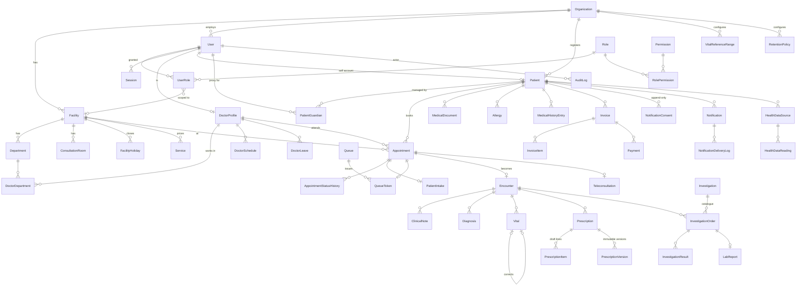

# Architecture — [APP_NAME]

Scope: the code as it exists in `server/` (API), `client/` (SPA, in progress) and `server/prisma/` (data model). File references are relative to the repository root.

## 1. Layers

```text
React SPA (client/)            role-specific pages, react-query, zod forms
        │  HTTPS /api  — httpOnly cookies + X-CSRF-Token (or Bearer for API clients)
        ▼
HTTP layer (server/src/app.ts, middleware/, routes/*.routes.ts)
        │  parse & validate (zod validators/, lib/http.ts), coarse permission gate
        ▼
Application services (server/src/services/**)
        │  use cases, transactions, resource-level policy (services/access/patientAccess.ts), audit
        ├──► Domain rules (server/src/domain/*) — pure functions: appointment transitions, money, vital validation
        ├──► Providers (server/src/providers/**, integrations/**) — notification, storage, payment, health data,
        │     teleconsult, signing, FHIR, ABDM (interfaces + mock/local/real adapters)
        ▼
Data access: Prisma 7 client (prisma-client generator, ESM) + @prisma/adapter-pg (server/src/lib/prisma.ts);
             query helpers in server/src/repositories/
        ▼
PostgreSQL 16 — schema.prisma + SQL safeguards (partial unique index, triggers, CHECKs)
```

Rules of the code base:

- Routers stay thin: validate input, call one service function, wrap in `{ success, data, meta? }` (`lib/http.ts#ok`).
- Services own transactions (`prisma.$transaction`) and write the audit entry in the same transaction where the change happens (`audit(entry, tx)`).
- Domain modules import no I/O.
- External systems are only reached through provider interfaces chosen at start-up (`providers/index.ts`).

## 2. Module map

| Module | Router (mount) | Services | Key tables |
|---|---|---|---|
| Health/config | `app.ts` (`/api/health*`, `/api/config`) | — | — |
| Auth | `auth.routes.ts` (`/api/auth`) | `auth/auth.service.ts`, `auth/tokens.ts`, `auth/passwords.ts`, `auth/principal.ts`, `auth/mfa.ts` (stub) | User, Session, Role, Permission, UserRole |
| Directory (public) | `directory.routes.ts` (`/api/directory`, also `/api/doctors`) | `doctor.service.ts`, `availability.service.ts`, `admin.service.ts#listFacilities` | Facility, Department, DoctorProfile, DoctorSchedule |
| Patients | `patients.routes.ts` (`/api/patients`) | `patient.service.ts`, `repositories/patient.repository.ts`, `timeline.service.ts`, `notifications/consent.service.ts` | Patient, PatientContact, PatientGuardian, Allergy, MedicalHistoryEntry, NotificationConsent |
| Appointments | `appointments.routes.ts` (`/api/appointments`) | `appointment.service.ts`, `availability.service.ts`, `domain/appointmentState.ts` | Appointment, AppointmentStatusHistory, WaitlistEntry, PatientIntake |
| Queue | `queue.routes.ts` (`/api/queue`) | `queue.service.ts` | Queue, QueueToken |
| Consultation | `clinical.routes.ts` (`/api/encounters`) | `encounter.service.ts` | Encounter, ClinicalNote, Diagnosis |
| Vitals | `clinical.routes.ts` (`/api/vitals`) | `vital.service.ts`, `domain/vitalRules.ts` | Vital, VitalReferenceRange |
| Prescriptions | `clinical.routes.ts` (`/api/prescriptions`) | `prescription.service.ts`, `pdf/prescriptionPdf.ts` | Medication, Prescription, PrescriptionItem, PrescriptionVersion |
| Investigations | `investigations.routes.ts` (`/api/investigations`) | `investigation.service.ts` | Investigation, InvestigationOrder, InvestigationResult, LabReport |
| Documents | `documents.routes.ts` (`/api/documents`) | `document.service.ts` | MedicalDocument |
| Billing | `billing.routes.ts` (`/api/billing`) | `billing.service.ts`, `domain/money.ts` | Service, Invoice, InvoiceItem, Payment |
| Notifications | `notifications.routes.ts` (`/api/notifications`) | `notifications/notification.service.ts`, `templates.ts`, `consent.service.ts`, `secureLink.service.ts` | Notification, NotificationDeliveryLog, NotificationConsent, SecureLink |
| Health data | `misc.routes.ts` (`/api/health-data`) | `healthData.service.ts` | HealthDataSource, HealthDataReading |
| Teleconsultation | `misc.routes.ts` (`/api/teleconsultation`) | `teleconsult.service.ts` | Teleconsultation |
| Dashboards / reports | `misc.routes.ts` (`/api/dashboards`, `/api/reports`) | `dashboard.service.ts`, `report.service.ts` | (read models) |
| Audit | `misc.routes.ts` (`/api/audit`) | `audit.service.ts` | AuditLog |
| Privacy | `misc.routes.ts` (`/api/privacy`) | `privacy.service.ts` | PrivacyRequest, RetentionPolicy |
| Interop | `misc.routes.ts` (`/api/interop`) | `interop.service.ts`, `integrations/fhir/mappers.ts`, `integrations/abdm/abdmProvider.ts` | (read models) |
| Admin | `admin.routes.ts` (`/api/admin`) | `admin.service.ts`, `orgSettings.ts` | Organization, Facility, Department, ConsultationRoom, FacilityHoliday, DoctorSchedule, DoctorLeave, VitalReferenceRange, RetentionPolicy |
| Test helpers | `test.routes.ts` (`/api/test`, only if `ENABLE_TEST_ROUTES`) | mock outbox | — |

Unused in code today: `FormDefinition` (schema only), `User.mfaEnabled` (always false).

## 3. Request lifecycle

Order is defined in `server/src/app.ts`:

| # | Stage | Implementation | Notes |
|---|---|---|---|
| 1 | Request context | `middleware/context.ts` | Accepts `X-Request-Id` if it matches `^[\w-]{8,64}$`, else generates a UUID; echoed in the response header; stored in `AsyncLocalStorage` (`lib/requestContext.ts`) with IP + user agent for audit/logs. |
| 2 | Security headers | `helmet` | CSP `default-src 'none'; frame-ancestors 'none'` (API returns JSON only), CORP `same-site`, HSTS 1 year + subdomains only when `NODE_ENV=production`; `x-powered-by` disabled; `trust proxy` = 1 hop in production. |
| 3 | CORS | `cors` | Origins from `CORS_ORIGINS`, `credentials: true`, explicit allowed headers (`Content-Type, X-CSRF-Token, Idempotency-Key, X-Access-Reason, X-Auth-Mode, Authorization, X-Request-Id`). |
| 4 | Body parsing | `express.json({limit:'1mb'})`, urlencoded 100 kb, `cookie-parser` | Multipart handled per route by multer (memory, `UPLOAD_MAX_BYTES`, 1 file). |
| 5 | Logging + metrics | `pino-http` (`lib/logger.ts`), `lib/metrics.ts` | Query strings stripped from logged URLs; `/api/health` not logged. |
| 6 | Rate limit | `middleware/rateLimit.ts` | `apiLimiter` 1200/min/IP on all `/api`; `loginLimiter` (IP + email) on login/register. |
| 7 | Authentication | `middleware/auth.ts#authenticate` | Bearer header or `cf_at` cookie → verify HS256 JWT (iss `careflow`, aud `careflow-api`) → session row must be active (revocation is immediate) → load principal (roles, permissions, facility scope, doctorId, selfPatientId). |
| 8 | CSRF | same middleware | Cookie-authenticated non-GET/HEAD/OPTIONS: `X-CSRF-Token` must equal the `cf_csrf` cookie → else 403 `CSRF_TOKEN_INVALID`. Bearer requests skip CSRF. |
| 9 | Permission gate | `requirePermission(...perms)` | At least one listed permission; denial is audited (`access.denied`). |
| 10 | Idempotency (selected routes) | `middleware/idempotency.ts` | See §6.4. |
| 11 | Validation | zod via `parseBody/parseQuery` | 400 `VALIDATION_ERROR` with `details: [{path, message}]`. |
| 12 | Service-level policy | `services/access/patientAccess.ts` and per-service checks | Patient ABAC, facility scope, ownership (treating doctor, prescribing doctor, lab scope). |
| 13 | Audit | `services/audit.service.ts` | Append-only; inside the business transaction when one exists. |
| 14 | Errors | `middleware/errorHandler.ts` | Maps `AppError`, multer, JSON syntax, Prisma P2002/P2025 to the error envelope; 5xx logged with requestId, message is generic. |

## 4. Data model

All timestamps are `timestamptz` (UTC); calendar dates (`dateOfBirth`, `queueDate`, `followUpDate`) are `@db.Date`. Money columns are `Decimal`. IDs are CUIDs; human-readable numbers come from an atomic counter table (`IdSequence`, `lib/ids.ts`): `APT-2026-000001`, `ENC-…`, `RX-…`, `ORD-…`, `INV-…`, UHID `<org.uhidPrefix>-<padded n>` (seed: `DHN-00000001`).

### 4.1 ERD (main entities)



Supporting tables not drawn: `Address`, `PatientContact`, `WaitlistEntry`, `Medication`, `SecureLink`, `IdempotencyRecord`, `IdSequence`, `PrivacyRequest`, `FormDefinition`.

### 4.2 Multi-organisation model

```text
Organization (code, uhidPrefix, settings JSON)
 └── Facility (type CLINIC | MULTI_SPECIALTY_CLINIC | HOSPITAL | DIAGNOSTIC_CENTER, timezone, registrationNo)
      ├── Department ── DoctorDepartment ── DoctorProfile (User)
      ├── ConsultationRoom (optional department)
      ├── DoctorSchedule (doctor × facility × department × room × dayOfWeek)
      └── Appointment (facility, department, doctor, patient)
                 └── Patient (belongs to one Organization; UHID unique)
```

- Staff users have `User.organizationId`; patients' own users have `organizationId = null` and reach data only through the portal rules.
- `UserRole.facilityId = null` → role applies organisation-wide (`facilityScope = 'ALL'`); otherwise the principal's scope is the listed facilities.
- Cross-organisation reads of a patient return `404 NOT_FOUND` (existence is not disclosed).
- Per-organisation settings (`services/orgSettings.ts`, cached 30 s): `bookingHorizonDays` 60, `minBookingLeadMinutes` 5, `holdMinutes` 5, `cancellationWindowHours` 2, `rescheduleWindowHours` 2, `reminderLeadHours` 24, `emergencyMessage`, `reviewMessage`, `prescriptionFooter`, `autoReleaseLabReports` true.

## 5. Authorization model

Two layers: coarse **RBAC** at the route (`requirePermission`) and **ABAC** in services (`services/access/patientAccess.ts` plus resource checks).

### 5.1 Roles × permissions (`server/src/config/rbac.ts`, seeded into Role/Permission tables)

| Permission | SA | HA | REC | DOC | NUR | LAB | PHA | ACC | PAT |
|---|---|---|---|---|---|---|---|---|---|
| portal:self | | | | | | | | | ✓ |
| appointment:book_self | | | | | | | | | ✓ |
| teleconsult:join | | | | | | | | | ✓ |
| patient:create | | | ✓ | | | | | | |
| patient:read | | ✓ | ✓ | ✓ | ✓ | | | | |
| patient:update | | | ✓ | | | | | | |
| patient:search | | ✓ | ✓ | ✓ | ✓ | | | | |
| clinical:read | | | | ✓ | ✓ | | | | |
| clinical:write | | | | ✓ | | | | | |
| clinical:break_glass | | | | ✓ | | | | | |
| appointment:read | | ✓ | ✓ | ✓ | ✓ | | | | |
| appointment:manage | | | ✓ | ✓ | | | | | |
| appointment:checkin | | | ✓ | | ✓ | | | | |
| queue:read | | ✓ | ✓ | ✓ | ✓ | | | | |
| queue:manage | | | ✓ | ✓ | ✓ | | | | |
| encounter:write | | | | ✓ | | | | | |
| vital:read | | | | ✓ | ✓ | | | | |
| vital:write | | | | ✓ | ✓ | | | | |
| prescription:read | | | | ✓ | | | | | |
| prescription:write | | | | ✓ | | | | | |
| prescription:finalize | | | | ✓ | | | | | |
| prescription:dispense_read | | | | | | | ✓ | | |
| investigation:order | | | | ✓ | | | | | |
| investigation:read | | | | ✓ | | ✓ | | | |
| investigation:process | | | | | | ✓ | | | |
| investigation:verify | | | | | | ✓ | | | |
| document:upload | | | ✓ | ✓ | | ✓ | | | |
| document:read | | | | ✓ | ✓ | | | | |
| billing:read | | ✓ | ✓ | | | | | ✓ | |
| billing:manage | | | ✓ | | | | | ✓ | |
| payment:refund | | | | | | | | ✓ | |
| notification:read | ✓ | ✓ | ✓ | | | | | | |
| notification:manage | ✓ | ✓ | | | | | | | |
| report:operational | ✓ | ✓ | | | | | | | |
| report:financial | | ✓ | | | | | | ✓ | |
| report:clinical | | | | ✓ | | | | | |
| audit:read | ✓ | ✓ | | | | | | | |
| user:manage | ✓ | ✓ | | | | | | | |
| role:manage | ✓ | | | | | | | | |
| org:manage | ✓ | | | | | | | | |
| facility:manage | ✓ | ✓ | | | | | | | |
| doctor:manage | ✓ | ✓ | | | | | | | |
| schedule:manage | ✓ | ✓ | | | | | | | |
| service:manage | ✓ | ✓ | | | | | | | |
| reference_range:manage | | | | ✓ | | | | | |
| healthdata:read | | | | ✓ | ✓ | | | | |
| teleconsult:host | | | | ✓ | | | | | |
| privacy:manage | | ✓ | | | | | | | |

SA super admin · HA hospital admin · REC receptionist · DOC doctor · NUR nurse · LAB lab technician · PHA pharmacist · ACC accountant · PAT patient. `org:manage` is granted but not checked by any route (there is no organisation-management API yet); `role:manage` is accepted as an alternative to `user:manage` on the role-grant routes.

### 5.2 Patient-level ABAC (`assertPatientAccess`, `portalPatientIds`)

Purposes: `demographics`, `appointments`, `clinical`, `billing`.

| Basis | Rule |
|---|---|
| self | Principal has `portal:self` and `selfPatientId === patientId`. |
| proxy | `PatientGuardian` row for (patient, user) with `status = ACTIVE`, not past `validUntil`; `accessLevel = APPOINTMENTS_ONLY` denies `clinical` and `billing`. Minors added by a caregiver are ACTIVE; adults are PENDING until staff activate (`POST /api/patients/:id/proxies/:proxyId/activate`). |
| staff_permission | Same organisation and `patient:read` (demographics) / `appointment:read` (appointments) / `billing:read` (billing). |
| care_relationship | Clinical purpose, `clinical:read`, principal is a doctor with any appointment or encounter with the patient. |
| facility_scope | Clinical purpose, `clinical:read`, non-doctor (nurse) and the patient has an appointment in one of the principal's facilities. |
| break_glass | Clinical purpose, `clinical:break_glass`, header `X-Access-Reason` ≥ 10 chars (honoured on `GET /api/patients/:id/medical-profile`); audited as `patient.break_glass`. |

Every allowed clinical access writes `record.access` (with basis) to the audit log; every denial writes `patient.access_denied`. Other resource checks: only the treating doctor writes an encounter; only the prescribing doctor edits/finalizes a prescription; drafts are invisible to everyone else; lab staff see orders in their facility scope with minimal patient identity; pharmacists read finalized prescriptions of their organisation (audited `prescription.dispense_view`); patients see lab results only after release and documents only when `PATIENT_VISIBLE`.

## 6. Appointment scheduling engine

### 6.1 Availability (`services/availability.service.ts#getAvailability`)

For a doctor and a local date: active `DoctorSchedule` rows for that weekday within `validFrom/validTo` (optionally one facility, filtered by consultation type) → skip if the facility has a `FacilityHoliday` → generate slots every `slotMinutes + bufferMinutes` from `startTime` to `endTime` in the facility timezone, skipping `breaks` → mark `BLOCKED` if overlapping `DoctorLeave` (LEAVE/HOLIDAY/SLOT_BLOCK), `PAST` if before now + `minBookingLeadMinutes` or after `bookingHorizonDays`, `FULL` if `booked ≥ capacity` (capacity = 1 + `overbookPerSlot`) or the session reached `maxAppointments`. Booked counts include active statuses and unexpired `HELD`. Availability is advisory; the database is authoritative.

### 6.2 State machine (`domain/appointmentState.ts`)

```text
HELD ──► CONFIRMED | BOOKED | CANCELLED
BOOKED ──► CONFIRMED | CHECKED_IN | CANCELLED | RESCHEDULED | NO_SHOW
CONFIRMED ──► CHECKED_IN | CANCELLED | RESCHEDULED | NO_SHOW | IN_CONSULTATION (teleconsult)
CHECKED_IN ──► WAITING | IN_CONSULTATION | CANCELLED | NO_SHOW
WAITING ──► IN_CONSULTATION | CANCELLED | NO_SHOW
IN_CONSULTATION ──► COMPLETED
COMPLETED, CANCELLED, RESCHEDULED, NO_SHOW: terminal
```

`transition()` updates with `WHERE id = ? AND status = <expected>` (compare-and-set) and writes `AppointmentStatusHistory`; a lost race returns `409 CONFLICT`.

### 6.3 Concurrency design

- **Partial unique index** (migration `db_safeguards`): `Appointment_active_slot_key ON Appointment(doctorId, startAt, slotSeq) WHERE isWalkIn = false AND status NOT IN ('CANCELLED','RESCHEDULED')`.
- **Seat loop** (`appointment.service.ts#book`, `#reschedule`): for `seat = 0 … capacity-1`, open a transaction that (a) cancels expired `HELD` rows for that exact slot (`cancelReason = 'HOLD_EXPIRED'`), (b) inserts with `slotSeq = seat`. A unique violation (P2002) means that seat is taken → try the next seat. No seat left → `409 SLOT_UNAVAILABLE`.
- **Holds**: `POST /appointments/holds` creates `HELD` with `holdExpiresAt = now + holdMinutes`; confirm after expiry cancels the hold and returns `SLOT_UNAVAILABLE`.
- **Idempotency**: booking, hold, confirm, reschedule, walk-in, encounter start/complete, prescription finalize/amend, invoice creation and payment accept `Idempotency-Key` (§6.4).
- **Walk-ins** are exempt from the slot index (`isWalkIn = true`) and go straight to the queue; queue transfers mark the appointment `isWalkIn` so the original slot is released.
- Duplicate guard: the same patient cannot hold/book the same doctor + start time twice (`409 CONFLICT`).
- Metric `appointment_booking_conflicts` counts 409s on `/api/appointments`.

### 6.4 Idempotency middleware (`middleware/idempotency.ts`)

Key = `Idempotency-Key` header (`^[\w-]{8,128}$`), scoped by user + route (`<routeKey>:<path>`); request hash = SHA-256 of canonical JSON body; record TTL 24 h (`IdempotencyRecord`).

| Situation | Result |
|---|---|
| New key | Row inserted as in-progress; response (status < 500) stored |
| Same key, same body, finished | Stored response replayed with header `Idempotent-Replay: true` |
| Same key, different body | `422 IDEMPOTENCY_KEY_REUSED` |
| Same key while first still running | `409 REQUEST_IN_PROGRESS` |
| First attempt ended with 5xx | Record deleted — the client may retry |

Payments add a second guard: `Payment.idempotencyKey` (unique, `<userId>:<key>`).

## 7. Queue design (`services/queue.service.ts`)

- One `Queue` per (doctor, facility, local date); room taken from the doctor's schedule.
- Token numbers: `Queue.lastTokenNumber` incremented in the check-in transaction; `(queueId, tokenNumber)` unique.
- Order: `priority DESC, tokenNumber ASC` (urgent walk-ins get priority 10).
- Token states: `WAITING → CALLED → IN_CONSULTATION → COMPLETED`, plus `SKIPPED` (requeue → WAITING), `ABSENT` (appointment → NO_SHOW), `TRANSFERRED` (new token in the target doctor's queue).
- `call-next` uses compare-and-set on `status = WAITING`; sends `QUEUE_CALLED` (WhatsApp, SMS) with dedupe key including `recallCount`.
- Starting/completing an encounter syncs the token (`syncTokenForAppointment`).
- Public board `GET /api/queue/display/:queueId`: doctor name, room, now serving, next 5 token numbers — no patient names.

## 8. Clinical record immutability

| Record | Mechanism |
|---|---|
| Vitals | Never updated in place: correction marks the original `CORRECTED` and inserts a new row with `correctsId` + `correctionReason` (unique `correctsId`); audit stores before/after values. |
| Notes | `DRAFT` notes editable only by the treating doctor while the encounter is in progress; completing the encounter finalizes all drafts; afterwards only `ADDENDUM` notes (status FINAL) can be added. |
| Encounter SOAP | Optimistic concurrency via `version`; `409 STALE_VERSION` on mismatch; read-only after completion. |
| Diagnoses | Removal sets `ENTERED_IN_ERROR` (no delete). |
| Lab results | Re-entry marks previous `CORRECTED` (`correctsId`); a reason is required once verified; re-entry clears verification. |
| Prescriptions | Draft items editable; `finalize` requires `{confirm:true}` and builds a snapshot → SHA-256 of canonical JSON (`contentHash`) → signing provider → `PrescriptionVersion` insert; `updateMany … WHERE currentVersion = <read>` guards concurrent finalize. `amend` creates version n+1 with a mandatory reason. DB trigger `PrescriptionVersion_immutable` rejects any update (except attaching `documentId` once) and all deletes. |
| Signing | `SessionAttestationSigner` = reference `attest:<sha256(rxId:version:hash:user:session)>` + statement "…not a digital signature certificate." `DigitalSignatureProviderStub` exists for a certificate-based provider (pending). |
| Audit / consent | Triggers `AuditLog_append_only`, `NotificationConsent_append_only` reject UPDATE/DELETE. |

## 9. Notification architecture

```text
service event (booking, queue call, Rx finalized, lab released, follow-up)
  └─► notify({patientId, templateKey, variables, dedupeKey, channels?})      notification.service.ts
        for each channel (default SMS, WHATSAPP, EMAIL):
          recipient? consent (latest NotificationConsent row, purpose TRANSACTIONAL)?
          INSERT Notification (dedupeKey = <key>:<channel> UNIQUE) status QUEUED | SKIPPED_NO_CONTACT | SKIPPED_NO_CONSENT
          duplicate insert → DUPLICATE_SUPPRESSED
          QUEUED → dispatch(): re-check consent → render template → provider.send()
                 → NotificationDeliveryLog row per attempt
                 → SENT | QUEUED (retry at base·2^(attempt-1) s) | FAILED (permanent or attempts exhausted)
worker: setInterval(processDue, NOTIFICATION_WORKER_INTERVAL_MS)  (0 disables)
receipts: recordReceipt(providerMessageId, DELIVERED|READ|FAILED)   (only reachable via test route today)
```

- Templates (`notifications/templates.ts`): `APPOINTMENT_CONFIRMED`, `APPOINTMENT_REMINDER`, `APPOINTMENT_RESCHEDULED`, `APPOINTMENT_CANCELLED`, `QUEUE_CALLED`, `PRESCRIPTION_READY`, `LAB_REPORT_READY`, `FOLLOW_UP_REMINDER`. Bodies contain no diagnoses, medicines or results; clinical items only carry a secure link. Each maps to a WhatsApp template name; `dltTemplateId` fields are empty (to be filled after DLT registration).
- Message bodies are not stored; `Notification.variables` are stored and excluded from the staff listing.
- Consent is opt-in: no row = not consented; an opt-out is honoured even for already-queued retries.
- **Secure links** (`secureLink.service.ts`): 24-byte random token, stored as SHA-256 hash, expires after `SECURE_LINK_TTL_HOURS` (72), limited uses (`maxUses`, default 5), URL `APP_BASE_URL/s/<token>`. Resolving requires the signed-in patient/proxy; another patient's session gets 403.
- Notification failures never fail the business operation (caught and logged).

## 10. Health-data architecture

- Interface `HealthDataProvider` (`providers/healthdata/types.ts`): `requestPermission`, `getHeartRate`, `pullSupported`, `clinicalGrade`.
- Adapters: `MockHealthDataProvider` (pull, deterministic scenarios) and `ClientIngestHealthProvider` for `APPLE_HEALTHKIT`, `ANDROID_HEALTH_CONNECT`, `WEARABLE`, `BLUETOOTH_DEVICE`, `CAMERA_PPG_DEMO` (push: the client app owns OS permission prompts and posts readings; server-side integration pending).
- Permission states per (patient, provider): `HealthDataSource.permissionStatus` GRANTED / DENIED / REVOKED; nothing is read or ingested unless GRANTED (`403 HEALTH_PERMISSION_DENIED`). Only the patient/proxy can connect, revoke, sync or push.
- Validation (`healthData.service.ts#validateReading`): 20–250 bpm, not > 5 min in the future, not older than 30 days → `VALID` / `INVALID`; `CAMERA_PPG_DEMO` → always `WELLNESS_ESTIMATE` ("not a clinically validated measurement"). `isClinicallyValidated` is always false. Duplicates are ignored via unique `(sourceId, externalId)`.
- Flags: only `VALID` readings are compared to the organisation's `VitalReferenceRange` → `WITHIN_RANGE | REQUIRES_REVIEW | URGENT_REVIEW | NOT_EVALUATED`, with configured review/emergency wording. **Flags prompt clinician review; they are not diagnoses.**
- Promotion: a clinician (`vital:write`) copies a `VALID` reading into `Vital` (source `HEALTH_PLATFORM` or `DEVICE`); estimates/invalid readings can never be promoted.

## 11. Storage

- `StorageProvider` (`providers/storage/types.ts`): `upload`, `download`, `remove`. Implementations: `local` (default; directory `STORAGE_LOCAL_DIR`, dirs 0700, files 0600, write-once `wx`, key regex + path-containment check), `mock` (memory), `s3` (stub → `503 PROVIDER_UNAVAILABLE`; implementation pending).
- Keys are server-generated: `patients/<patientId>/<uuid>`; filenames are sanitized and stored as metadata only.
- Uploads: PDF/PNG/JPEG only; declared MIME, extension and magic bytes (`file-type`) must agree; size ≤ `UPLOAD_MAX_BYTES` (10 MB).
- Downloads: two steps. `GET /api/documents/:id/url` (authorised) returns `/api/documents/download/<token>` where token = `base64url({d, u, exp}).HMAC-SHA256(AUTH_SECRET)`; TTL `DOWNLOAD_URL_TTL_SECONDS` (300). The download endpoint re-authenticates, checks the token's user matches the caller, re-authorises the document, and responds with `Cache-Control: no-store`, `X-Content-Type-Options: nosniff`, `Content-Security-Policy: default-src 'none'; sandbox`, attachment disposition (inline only for PDFs with `?inline=1`). Every URL issue and access is audited.

## 12. Payments

- `PaymentProvider` (`providers/payment/types.ts`): `createPayment`, `refund`. Only `MockPaymentProvider` exists; the interface assumes hosted checkout — no card data is handled.
- Money math in integer paise (`domain/money.ts`): `toPaise`, `fromPaise`, `taxOn` (half-up), `computeInvoice` (line discount, invoice discount, per-line tax); stored as `Decimal`. API responses serialise Decimals as strings (e.g. `"600"`).
- Invoice states: `ISSUED → PARTIALLY_PAID → PAID`; refunds reduce `amountPaid` and set payment `PARTIALLY_REFUNDED`/`REFUNDED`. Portal users can pay their own invoices by card/UPI/online, not cash.

## 13. Teleconsultation

`TeleconsultationProvider` (`createSession`, `issueJoinToken`, `endSession`); only `MockTeleconsultationProvider`. Join (`teleconsult.service.ts#join`): caller must be the appointment's doctor (`teleconsult:host`) or the patient/proxy; window from 15 min before start to 60 min after end; patient must send `consent: true` on first join (stored as `patientConsentAt`); token is HMAC-signed, 10 min, bound to user + role; no public meeting links. The doctor can `convert-in-person` with a note (modality decision stays with the clinician) or `end`.

## 14. Interoperability

- FHIR R4 mapping layer `integrations/fhir/mappers.ts` builds `Patient`, `Practitioner`, `Encounter`, `Condition`, `AllergyIntolerance`, `Observation` (vital signs with LOINC codes), `MedicationRequest`, `DiagnosticReport` + result `Observation`s, `Appointment`, `DocumentReference`; `GET /api/interop/fhir/Patient/:id/everything` returns a `collection` Bundle (`application/fhir+json`). The database is not a FHIR store. Profiles (e.g. NRCeS/ABDM IG) are **not** validated.
- ABDM boundary `integrations/abdm/abdmProvider.ts`: `verifyAbhaAddress`, `linkCareContext`, `handleConsentRequest` — mock returns `NOT_CONNECTED`. `GET /api/interop/abdm/status` reports `connected: false`.

## 15. AI-assistive design

No AI provider is implemented. The data model and workflow reserve a safe path: `ClinicalNote.isAiDraft` + `aiReviewedById`; AI drafts cannot be addenda; `POST /api/encounters/notes/:noteId/approve-ai-draft` records the approving clinician (optionally with edited content); `complete` is blocked while unreviewed AI drafts exist.

## 16. Observability

| Endpoint / component | Behaviour |
|---|---|
| `GET /api/health` | Liveness, no DB access |
| `GET /api/health/ready` | `SELECT 1` + provider names + demo mode (500 if DB down) |
| `GET /api/health/metrics` | In-process counters (`http_5xx`, `appointment_booking_conflicts`) and latency per `METHOD /api/<module>` (count, avg, max). Per process, reset on restart; requires `report:operational`. Replace with Prometheus/OpenTelemetry for production. |
| Logging | pino JSON (`service: careflow-api`), request id on errors, redaction (see SECURITY.md); `pino-pretty` available as dev dependency. |
| Audit | Business/security events in `AuditLog` (queryable via `GET /api/audit`). |

## 17. Key decisions (ADR summary)

| # | Decision | Rationale | Trade-offs |
|---|---|---|---|
| 1 | Modular monolith (one API process, module routers/services) | Small team, transactional consistency across scheduling/clinical/billing, simple deploy | Modules share one DB; boundaries enforced by convention; scale by replicas, not per module |
| 2 | Prisma 7 `prisma-client` generator + `@prisma/adapter-pg` (ESM, generated into `src/generated`) | Type-safe queries, driver adapter on node-postgres, no Rust query engine at runtime | Some rules (partial index, triggers) live in hand-written SQL migrations; the CLI still downloads a schema engine → offline WASM fallback script |
| 3 | httpOnly cookie sessions + CSRF double-submit; bearer optional | Tokens unreadable by JS (XSS blast radius), SameSite=Lax + CSRF header | Needs CSRF handling in clients; refresh endpoint relies on SameSite/path scoping |
| 4 | Short JWT (15 min) + DB session check on every request + rotating refresh (7 days) with reuse detection | Immediate revocation (logout, password change, deactivation) | One DB read per request |
| 5 | Store UTC, compute schedules in facility timezone | Correct instants across facilities/DST-free IST today | Some list/"next slot" code still assumes `Asia/Kolkata` |
| 6 | Money as `Decimal` in DB, integer paise in code | No floating-point errors | Decimals serialised as strings in JSON |
| 7 | DB-enforced booking uniqueness (partial index) + seat loop | Correct under concurrency without advisory locks | Capacity > 1 needs up to N insert attempts |
| 8 | Immutable clinical records (correction rows, addenda, versioned prescriptions + trigger) | Medico-legal traceability | More rows; reads filter `status = ACTIVE` |
| 9 | Provider interfaces with mock defaults | Safe local/dev/test; no accidental real sends | Real adapters exist but are unverified against live providers |
| 10 | Minimal-content notifications + secure links requiring login | Keeps health data out of SMS/WhatsApp | Extra step for patients |
| 11 | Review flags from clinician-configured ranges, never diagnoses | Avoids SaMD-type claims | Ranges must be configured per organisation |
| 12 | FHIR as an on-demand mapping, not the storage model | Keeps core schema simple | Mapping must be profiled/validated before exchange |
